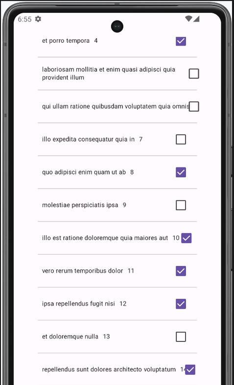
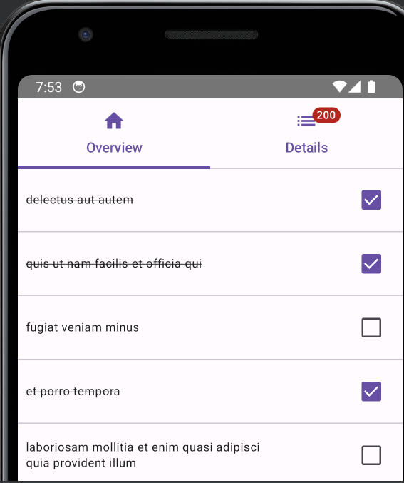
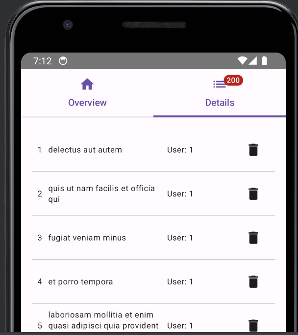
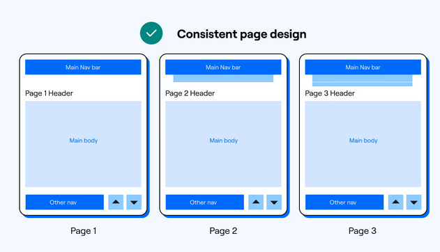

:sectnums:
:toc:
:icons: font
:source-highlighter: coderay
= Android Übung - David Lehner
:docinfo:
:description: Android Übung - David Lehner

== Implementierung der Demo

* Erste Schritte nach Anleitung von Herr Prof. Stuetz
* link:https://htl-leonding-college.github.io/android-reactive-java-todo/[Demo]

== Schritt 1: Erstellen eines neuen Projekts

* Erstellen eines neuen Projekts mit Android Studio
* Leere Activity gewählt
* API 30 verwendet

== Schritt 2: Hinzufügen der benötigten Libraries

* RxJava Library, Dagger/Hilt, resteasy-client, jackson-databind, smallrye-config

[%collapsible]
.build.gradle.kts(:app)
====
[source,toml]
----
plugins {
    alias(libs.plugins.android.application)
    alias(libs.plugins.jetbrains.kotlin.android)
    alias(libs.plugins.kotlinAndroidKsp)
    alias(libs.plugins.hiltAndroid)
}

android {
    namespace = "at.htl.todo"
    compileSdk = 34

    defaultConfig {
        applicationId = "at.htl.todo"
        minSdk = 30
        targetSdk = 34
        versionCode = 1
        versionName = "1.0"

        testInstrumentationRunner = "androidx.test.runner.AndroidJUnitRunner"
        vectorDrawables {
            useSupportLibrary = true
        }
    }

    buildTypes {
        release {
            isMinifyEnabled = false
            proguardFiles(
                getDefaultProguardFile("proguard-android-optimize.txt"),
                "proguard-rules.pro"
            )
        }
    }
    compileOptions {
        sourceCompatibility = JavaVersion.VERSION_17
        targetCompatibility = JavaVersion.VERSION_17
    }
    kotlinOptions {
        jvmTarget = "17"
    }
    buildFeatures {
        compose = true
    }
    composeOptions {
        kotlinCompilerExtensionVersion = "1.5.13"
    }
    packaging {
        resources {
            excludes += "/META-INF/{AL2.0,LGPL2.1}"
            excludes += "/META-INF/INDEX.LIST"
            excludes += "/META-INF/DEPENDENCIES"
            excludes += "/META-INF/LICENSE.md"
            excludes += "/META-INF/NOTICE.md"
        }
    }
}

dependencies {

    implementation(libs.androidx.core.ktx)
    implementation(libs.androidx.lifecycle.runtime.ktx)
    implementation(libs.androidx.activity.compose)
    implementation(platform(libs.androidx.compose.bom))
    implementation(libs.androidx.ui)
    implementation(libs.androidx.ui.graphics)
    implementation(libs.androidx.ui.tooling.preview)
    implementation(libs.androidx.material3)
    testImplementation(libs.junit)
    androidTestImplementation(libs.androidx.junit)
    androidTestImplementation(libs.androidx.espresso.core)
    androidTestImplementation(platform(libs.androidx.compose.bom))
    androidTestImplementation(libs.androidx.ui.test.junit4)
    debugImplementation(libs.androidx.ui.tooling)
    debugImplementation(libs.androidx.ui.test.manifest)

    // RxJava
    implementation (libs.rxjava)
    implementation(libs.rxandroid)
    implementation(libs.androidx.runtime.rxjava3)

    // Hilt
    implementation(libs.hilt.android)
    ksp(libs.hilt.compiler)

    // Jackson
    implementation(libs.jackson.databind)

    // Resteasy
    implementation(libs.resteasy.client)

    // SmallRye Config
    //implementation("org.eclipse.microprofile.config:microprofile-config-api:3.1") // for application.properties config loader
    implementation(libs.smallrye.config)

}

----
====

[%collapsible]
.build.gradle.kts(todo)
====
[source,toml]
----
// Top-level build file where you can add configuration options common to all sub-projects/modules.
plugins {
    alias(libs.plugins.android.application) apply false
    alias(libs.plugins.jetbrains.kotlin.android) apply false
    alias(libs.plugins.hiltAndroid) apply false
    alias(libs.plugins.kotlinAndroidKsp) apply false
}
----
====

[%collapsible]
.libs.versions.toml
====
[source,toml]
----
[versions]
agp = "8.4.0"
hiltVersion = "2.51.1"
jacksonDatabind = "2.17.1"
kotlin = "1.9.23"
coreKtx = "1.13.1"
junit = "4.13.2"
junitVersion = "1.1.5"
espressoCore = "3.5.1"
lifecycleRuntimeKtx = "2.7.0"
activityCompose = "1.9.0"
composeBom = "2024.05.00"
resteasyClient = "6.2.8.Final"
rxjavaVersion = "3.1.8"
rxandroid = "3.0.2"
runtimeRxjava3 = "1.6.7"
ksp = "1.9.23-1.0.20"
smallryeConfig = "3.8.1"

[libraries]
androidx-core-ktx = { group = "androidx.core", name = "core-ktx", version.ref = "coreKtx" }
hilt-android = { module = "com.google.dagger:hilt-android", version.ref = "hiltVersion" }
hilt-compiler = { module = "com.google.dagger:hilt-compiler", version.ref = "hiltVersion" }
jackson-databind = { module = "com.fasterxml.jackson.core:jackson-databind", version.ref = "jacksonDatabind" }
junit = { group = "junit", name = "junit", version.ref = "junit" }
androidx-junit = { group = "androidx.test.ext", name = "junit", version.ref = "junitVersion" }
androidx-espresso-core = { group = "androidx.test.espresso", name = "espresso-core", version.ref = "espressoCore" }
androidx-lifecycle-runtime-ktx = { group = "androidx.lifecycle", name = "lifecycle-runtime-ktx", version.ref = "lifecycleRuntimeKtx" }
androidx-activity-compose = { group = "androidx.activity", name = "activity-compose", version.ref = "activityCompose" }
androidx-compose-bom = { group = "androidx.compose", name = "compose-bom", version.ref = "composeBom" }
androidx-ui = { group = "androidx.compose.ui", name = "ui" }
androidx-ui-graphics = { group = "androidx.compose.ui", name = "ui-graphics" }
androidx-ui-tooling = { group = "androidx.compose.ui", name = "ui-tooling" }
androidx-ui-tooling-preview = { group = "androidx.compose.ui", name = "ui-tooling-preview" }
androidx-ui-test-manifest = { group = "androidx.compose.ui", name = "ui-test-manifest" }
androidx-ui-test-junit4 = { group = "androidx.compose.ui", name = "ui-test-junit4" }
androidx-material3 = { group = "androidx.compose.material3", name = "material3" }
resteasy-client = { module = "org.jboss.resteasy:resteasy-client", version.ref = "resteasyClient" }
rxjava = { module = "io.reactivex.rxjava3:rxjava", version.ref = "rxjavaVersion" }
rxandroid = { module = "io.reactivex.rxjava3:rxandroid", version.ref = "rxandroid" }
androidx-runtime-rxjava3 = { module = "androidx.compose.runtime:runtime-rxjava3", version.ref = "runtimeRxjava3" }
smallrye-config = { module = "io.smallrye.config:smallrye-config", version.ref = "smallryeConfig" }

[plugins]
android-application = { id = "com.android.application", version.ref = "agp" }
jetbrains-kotlin-android = { id = "org.jetbrains.kotlin.android", version.ref = "kotlin" }
kotlinAndroidKsp = { id = "com.google.devtools.ksp", version.ref = "ksp" }
hiltAndroid = { id = "com.google.dagger.hilt.android", version.ref = "hiltVersion" }
----
====

== Schritt 3: Konfigurationen aus der Demo

=== Java Business Logic von Kotlin-Compose-Klassen trennen

* Erstellen eines Java Application-Entry-Points (TodoApplication)

.TodoApplication
[%collapsible]
====
[source,java]
----

package at.htl.todo;

import android.app.Application;
import javax.inject.Singleton;
import dagger.hilt.android.HiltAndroidApp;

@HiltAndroidApp
@Singleton
public class TodoApplication extends Application {

    static final String TAG = TodoApplication.class.getSimpleName();

    @Override
    public void onCreate() {
        super.onCreate();
        Log.i(TAG, "App started ...");
    }

}
----
====

=== Konfiguration zur Verwendung des Internets

* Hinzufügen der Berechtigung zur Verwendung des Internets in der AndroidManifest.xml

[%collapsible]
.AndroidManifest.xml
====
[source,toml]
----

<?xml version="1.0" encoding="utf-8"?>
<manifest xmlns:android="http://schemas.android.com/apk/res/android"
    xmlns:tools="http://schemas.android.com/tools">

    <uses-permission android:name="android.permission.INTERNET" />

    <application
        android:name=".TodoApplication"
        android:allowBackup="true"
        android:dataExtractionRules="@xml/data_extraction_rules"
        android:fullBackupContent="@xml/backup_rules"
        android:icon="@mipmap/ic_launcher"
        android:label="@string/app_name"
        android:roundIcon="@mipmap/ic_launcher_round"
        android:supportsRtl="true"
        android:theme="@style/Theme.Todo"
        tools:targetApi="31">
        <activity
            android:name=".MainActivity"
            android:exported="true"
            android:label="@string/app_name"
            android:theme="@style/Theme.Todo">
            <intent-filter>
                <action android:name="android.intent.action.MAIN" />

                <category android:name="android.intent.category.LAUNCHER" />
            </intent-filter>
        </activity>
    </application>

</manifest>

----
====

=== Util Klassen heruntergeladen und hinzugefügt

* Beinhaltet: Immer, Mapper, Resteasy, Store
* Immer: link:https://immerjs.github.io/immer/[Immer]
* Mapper: marshalling und unmarshalling von Java-Objekten
* Resteasy: REST-Client
* Store: Mit BehaviorSubject, welches immer den aktuellsten Wert speichert.
* Application-properties Datei erstellt, welche für den Rest-Client benötigt wurde.

IMPORTANT :: Die Klassen wurden direkt aus der Demo übernommen und nicht verändert.

== Schritt 4: Implementierung des Models

Generelles:
Das Projekt wurde nach dem Model-View-ViewModel (MVVM) Pattern aufgebaut.
(Single-Source-of-Truth-Prinzip)

* Model-Klasse für die Todos erstellt
** Beinhaltet ein Array für Todos, die von der API geladen werden
** Beinhaltet uiState Feld, welches für Tabs verwendet wird
** Speichert sozusagen den Zustand der App

.Model

[%collapsible]
====
[source,java]
----
package at.htl.todo.model;

import java.util.List;

public class Model {
public static class UIState {
public int selectedTab = 0;
}
public Todo[] todos = new Todo[0];
public UIState uiState = new UIState();

}
----
====

---

* ModelStore-Klasse erstellt
** Beinhaltet Methoden zum Laden der Todos und zum Setzen des UIStates
** Weiters Zugriff auf das Model, wie Update der Todos, und löschen
** Stellt im Grunde genommen den Zugriff auf das Model dar
** Erbt von Store, welcher ein BehaviorSubject beinhaltet. Benutzt für das Single-Source-of-Truth-Prinzip

.ModelStore
[%collapsible]
====
[source,java]
----
package at.htl.todo.model;
import android.util.Log;

import java.util.Arrays;

import javax.inject.Inject;
import javax.inject.Singleton;
import at.htl.todo.util.store.Store;

@Singleton
public class ModelStore extends Store<Model>  {

    @Inject
    ModelStore() {
        super(Model.class, new Model());
    }

    public void setTodos(Todo[] todos) {
        apply(model -> model.todos = todos);
    }
    public void selectTab(int tabIndex) {
        apply(model -> model.uiState.selectedTab = tabIndex);
    }

    public void updateTodoCompleted(int index, boolean completed) {
        apply(model -> model.todos[index].completed = completed);
        Log.i("ModelStore", "Updated todo at index " + index + " to completed: " + completed);
    }

    public void delete(int index){
        apply(model -> {
            Todo[] todosAll = model.todos;
            // remove element at index
            Todo[] todos = new Todo[todosAll.length - 1];
            System.arraycopy(todosAll, 0, todos, 0, index);
            System.arraycopy(todosAll, index + 1, todos, index, todosAll.length - index - 1);
            model.todos = todos;
        });
    }
}

----
====

.Store

[%collapsible]
====
[source,java]
----
package at.htl.todo.util.store;

import java.util.concurrent.CompletionException;
import java.util.function.Consumer;

import at.htl.todo.util.immer.Immer;
import io.reactivex.rxjava3.subjects.BehaviorSubject;

public class Store<T> {
    public final BehaviorSubject<T> pipe;
    public final Immer<T> immer;

    protected Store(Class<? extends T> type, T initialState) {
        try {
            pipe = BehaviorSubject.createDefault(initialState);
            immer = new Immer<T>(type);
        } catch (Exception e) {
            throw new CompletionException(e);
        }
    }
    public void apply(Consumer<T> recipe) {
        pipe.onNext(immer.produce(pipe.getValue(), recipe));
    }
}
----
====

---

* Todo-Klasse erstellt
** Beinhaltet die Eigenschaften eines Todos

.Todo

[%collapsible]
====
[source,java]
----
package at.htl.todo.model;

public class Todo {
    public Long userId;
    public Long id;
    public String title;
    public boolean completed;

    public Todo() {
    }

    public Todo(Long userId, Long id, String title, boolean completed) {
        this.userId = userId;
        this.id = id;
        this.title = title;
        this.completed = completed;
    }
}
----
====

---

* TodoClient-Klasse erstellt
** Beinhaltet Endpoints zum Laden der Todos von der API

.TodoClient

[%collapsible]
====
[source,java]
----
package at.htl.todo.model;

import jakarta.ws.rs.Consumes;
import jakarta.ws.rs.GET;
import jakarta.ws.rs.Path;
import jakarta.ws.rs.core.MediaType;

@Path("/todos")
@Consumes(MediaType.APPLICATION_JSON)
public interface TodoClient {
    @GET
    Todo[] all();
}

----
====

---

* TodoService-Klasse erstellt
** Beinhaltet Methoden zum Laden der Todos von der API

.TodoService

[%collapsible]
====
[source,java]
----
package at.htl.todo.model;

import android.util.Log;

import java.util.concurrent.CompletableFuture;

import javax.inject.Inject;
import javax.inject.Singleton;

import at.htl.todo.util.resteasy.RestApiClientBuilder;

@Singleton
public class TodoService {
    static final String TAG = TodoService.class.getSimpleName();
    public static String JSON_PLACEHOLDER_BASE_URL = "https://jsonplaceholder.typicode.com";
    public final TodoClient todoClient;
    public final ModelStore store;

    @Inject
    TodoService(RestApiClientBuilder builder, ModelStore store) {
        Log.i(TAG, "Creating TodoService with base url: " + JSON_PLACEHOLDER_BASE_URL);
        todoClient = builder.build(TodoClient.class, JSON_PLACEHOLDER_BASE_URL);
        this.store = store;
    }

    public void getAll() {
        CompletableFuture
                .supplyAsync(() -> todoClient.all())
                .thenAccept(store::setTodos)
                .exceptionally((e) -> {
                    Log.e(TAG, "Error loading todos", e);
                    return null;
                });
    }
}
----
====

== Schritt 5: Implementierung der Views

* Am Anfang nach den Schritten im Tutorial von Herr Prof. Stuetz vorgegangen

.Vorher

.Nachher Übersicht

.Nachher Details

* Die MainView Klasse wurde erweitert.
** Checkbox kann gedrückt werden, um Todos auf erledigt und nicht erledigt zu setzen
** Text wurde auf eine maximale Breite gesetzt, weil vorher nicht sehr schön

* Details Seite wurde hinzugefügt
** Lässt das Löschen der Todos zu
** Weitere Informationen, wie IDs, UserIDs werden angezeigt.

=== Änderungen an den Views

* MainView überarbeitet und 3 weitere für Tabs hinzugefügt

IMPORTANT:: Zur besseren Lesbarkeit wurden in den Klassen die Imports entfernt

.MainView vorher
[%collapsible]
====
[source,java]
----

package at.htl.todo.ui.layout

@Singleton
class MainView @Inject constructor() {

    @Inject
    lateinit var store: ModelStore

    fun buildContent(activity: ComponentActivity) {
        activity.enableEdgeToEdge()
        activity.setContent {
            val viewModel = store
                .pipe
                .observeOn(AndroidSchedulers.mainThread())
                .subscribeAsState(initial = Model())
                .value
            Surface(
                modifier = Modifier.fillMaxSize(),
                color = MaterialTheme.colorScheme.background
            ) {
                Todos(model = viewModel, modifier = Modifier.padding(all = 32.dp))
            }
        }
    }
}

@Composable
fun Todos(model: Model, modifier: Modifier = Modifier) {
    val todos = model.todos
    LazyColumn(
        modifier = modifier.padding(16.dp)
    ) {
        items(todos.size) { index ->
            TodoRow(todo  = todos[index])
            HorizontalDivider()
        }
    }
}

@Composable
fun TodoRow(todo: Todo) {
    Row(
        modifier = Modifier
            .fillMaxWidth()
            .padding(8.dp),
        verticalAlignment = Alignment.CenterVertically
    ) {
        Text(
            text = todo.title,
            style = MaterialTheme.typography.bodySmall
        )
        Spacer(modifier = Modifier.width(8.dp))
        Text(
            text = todo.id.toString(),
            style = MaterialTheme.typography.bodySmall
        )
        Spacer(modifier = Modifier.weight(1f))
        Checkbox(
            checked = todo.completed,
            onCheckedChange = { /* Update the completed status of the todo item */ }
        )
    }
}

@Preview(showBackground = true)
@Composable
fun TodoPreview() {
    val model = Model()
    val todo = Todo()
    todo.id = 1
    todo.title = "First Todo"
    model.todos = arrayOf(todo)

    TodoTheme {
        Todos(model)
    }
}
----
====

.MainView nachher
[%collapsible]
====
[source,java]
----
package at.htl.todo.ui.layout

@Singleton
class MainView @Inject constructor(store: ModelStore) {
    val store = store
}

@Composable
fun Todos(model: Model, modifier: Modifier = Modifier, store: ModelStore) {
    val todos = model.todos
    LazyColumn(
    ) {
        items(todos.size) { index ->
            TodoRow(todo = todos[index], index = index, store = store)
            HorizontalDivider()
        }
    }
}

@Composable
fun TodoRow(todo: Todo, index: Int, store: ModelStore) {
    Row(
        modifier = Modifier
            .fillMaxWidth()
            .padding(8.dp),
        verticalAlignment = Alignment.CenterVertically
    ) {
        Text(
            text = todo.title,
            style = MaterialTheme.typography.bodySmall,
            overflow = TextOverflow.Ellipsis, //<1>
            modifier = Modifier.weight(3f) // <1>
        )
        Spacer(modifier = Modifier.width(8.dp))
        Spacer(modifier = Modifier.weight(1f))
        Checkbox(
            checked = todo.completed,
            onCheckedChange = { isChecked ->
                store.updateTodoCompleted(index, isChecked) // <2>
            }
        )
    }
}

----

Zugehörige Funktion in ModelStore hinzugefügt
[source, java]
----
    public void updateTodoCompleted(int index, boolean completed) {
        apply(model -> model.todos[index].completed = completed);
        Log.i("ModelStore", "Updated todo at index " + index + " to completed: " + completed);
    }
----

* buildContent entfernt, da nicht mehr benötig

1. Bedingungen für Text hinzugefügt (Breite und TextOverflow)
2. Checkbox onCheckedChange ausimplementiert, um Todos auf erledigt und nicht erledigt zu setzen

====

.DetailsView
[%collapsible]
====
[source,java]
----
package at.htl.todo.ui.layout

@Singleton
class DetailsView @Inject constructor() {
}

@Composable
fun TodosDetail(model: Model, modifier: Modifier = Modifier, store: ModelStore) {
    val todos = model.todos
    LazyColumn(
        modifier = modifier.padding(16.dp)
    ) {
        items(todos.size) { index ->
            TodoDetailRow(todo = todos[index], index = index, store = store)
            HorizontalDivider()
        }
    }
}

@Composable
fun TodoDetailRow(todo: Todo, index: Int, store: ModelStore) {
    Row(
        modifier = Modifier
            .fillMaxWidth()
            .padding(8.dp),
        verticalAlignment = Alignment.CenterVertically
    ) {
        Text( //<2>
            text = todo.id.toString(),
            style = MaterialTheme.typography.bodySmall,
            overflow = TextOverflow.Ellipsis,
        )
        Spacer(modifier = Modifier.width(8.dp))
        Text(
            text = todo.title,
            style = MaterialTheme.typography.bodySmall,
            overflow = TextOverflow.Ellipsis,
            modifier = Modifier.weight(3f)
        )
        Spacer(modifier = Modifier.width(8.dp))
        Text( //<2>
            text = "User: " + todo.userId.toString(),
            style = MaterialTheme.typography.bodySmall,
            overflow = TextOverflow.Ellipsis,
        )
        Spacer(modifier = Modifier.width(8.dp))
        Spacer(modifier = Modifier.weight(1f))
        IconButton(onClick = {
            store.delete(index) //<1>
        }) {
            Icon(Icons.Default.Delete, contentDescription = "Delete")
        }
    }
}
----

Zugehörige Funktion in ModelStore hinzugefügt

[source, java]
----
    public void delete(int index){
        apply(model -> {
            Todo[] todosAll = model.todos;
            // remove element at index
            Todo[] todos = new Todo[todosAll.length - 1];
            System.arraycopy(todosAll, 0, todos, 0, index);
            System.arraycopy(todosAll, index + 1, todos, index, todosAll.length - index - 1);
            model.todos = todos;
        });
    }
----

1. Funktion zum Löschen von Todos hinzugefügt
2. Details Page zeigt zusätzlich Id der Todos und User an

====

.MainViewBuilder
[%collapsible]
====
[source,java]
----
package at.htl.todo.ui.layout

@Singleton
class MainViewBuilder {
    @Inject
    lateinit var store: ModelStore

    @Inject
    lateinit var toDoService: TodoService

    @Inject
    constructor() {
    }
    fun setContentOfActivity(activity: ComponentActivity) {
        val view = ComposeView(activity)
        view.setContent {
            val viewModel = store.pipe.observeOn(AndroidSchedulers.mainThread()).subscribeAsState(initial = Model()).value
            Surface(
                modifier = Modifier.fillMaxSize()
            ) {
                TabScreen(viewModel, store, toDoService, activity)
            }
        }
        activity.setContentView(view)
    }
}
----

* Während die MainView vorher der "Einstiegspunkt" war, ist der MainViewBuilder der neue Einstiegspunkt
* Der MainViewBuilder verweist auf den TabScreen, Erklärung im nächsten Dropdown

.MainActivity
[source, java]
----
    @Inject
    MainView mainView;

    @Inject
    MainViewBuilder mainViewBuilder; //<1>
    @Inject
    TodoService todoService;

    @Override
    public void onCreate(Bundle savedInstanceState) {
        super.onCreate(savedInstanceState);
        Config.load(this);
        var base_url = Config.getProperty("json.placeholder.baseurl");
        Log.i(TAG, "onCreate: " + base_url);
        todoService.getAll();
        mainViewBuilder.setContentOfActivity(this);
    }
----
1. Die MainActivity verwendet nun nämlich den MainViewBuilder, während zuvor einfach die MainView mit buildContent()
verwendet wurde

====

.TabScreen
[%collapsible]
====
[source,java]
----
package at.htl.todo.ui.layout

@Composable
fun TabScreen(model: Model, store: ModelStore?, toDoService: TodoService?, activity: ComponentActivity) {
    var uiState = model.uiState
    val tabIndex = uiState.selectedTab
    val tabs = listOf("Overview", "Details")
    Column(modifier = Modifier.fillMaxWidth()) {
        TabRow(selectedTabIndex = uiState.selectedTab) {
            tabs.forEachIndexed { index, title ->
                Tab(text = { Text(title) },
                    selected = tabIndex == index,
                    onClick = { store?.selectTab(index)},
                    icon = {
                        when (index) {
                            0 -> Icon(imageVector = Icons.Default.Home, contentDescription = null) //<1>
                            1 -> BadgedBox(badge = { Badge { Text("${model.todos.size}") }}) { //<2>
                                Icon(Icons.Filled.List, contentDescription = "ToDos")
                            }
                        }
                    }
                )
            }
        }
        when (tabIndex) {
            0 -> store?.let { Todos(model = model, modifier = Modifier.padding(top = 56.dp), store = it) } //<1>
            1 -> store?.let { TodosDetail(model = model, store = it) } //<2>
        }
    }
}

----

* Der Tabscreen leitet einen je nach ausgewähltem Tab auf die gewünschte "Seite" weiter
* Die Tabs sind "Overview" und "Details"
* Die Tabs haben jeweils ein Icon, welches den Tab repräsentiert

1. Verweist auf die Overview Seite (MainView) via Todos
2. Verweist auf die Details Seite via TodosDetail

====

== Designprinzipien:

=== Konsistentes Design
* Geachtet darauf, dass sich die Tabs dort befinden, wo sie erwartet werden
** Am oberen Ende

.Prinzip

.Implementierung

---

=== Feedback und Klarheit
* Wenn ein Todo erledigt ist, wird es in der Checkbox rechts angezeigt
* In der Details seite ist ein Mistkübel zum löschen sichtbar, welcher durch die Wahl des Icons selbsterklärend ist.
* Eine Anzeige oben rechts bietet eine schnelle Übersicht, wieviele Todos vorhanden sind.
* Durchgestrichene Todos sollten klar anzeigen, wenn ein Todo erledigt wurde zusätzlich zur Checkbox

.Implementierung

== Übung 3: