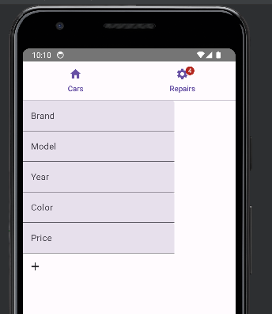

:sectnums:
:toc:
:icons: font
:source-highlighter: coderay
= Android Übung - David Lehner
:docinfo:
:description: Android Übung - David Lehner

== Implementierung der Demo

* Erste Schritte nach Anleitung von Herr Prof. Stuetz
* link:https://htl-leonding-college.github.io/android-reactive-java-todo/[Demo]

== Schritt 1: Erstellen eines neuen Projekts

* Erstellen eines neuen Projekts mit Android Studio
* Leere Activity gewählt
* API 30 verwendet

== Schritt 2: Hinzufügen der benötigten Libraries

* RxJava Library, Dagger/Hilt, resteasy-client, jackson-databind, smallrye-config

[%collapsible]
.build.gradle.kts(:app)
====
[source,toml]
----
plugins {
    alias(libs.plugins.android.application)
    alias(libs.plugins.jetbrains.kotlin.android)
    alias(libs.plugins.kotlinAndroidKsp)
    alias(libs.plugins.hiltAndroid)
}

android {
    namespace = "at.htl.todo"
    compileSdk = 34

    defaultConfig {
        applicationId = "at.htl.todo"
        minSdk = 30
        targetSdk = 34
        versionCode = 1
        versionName = "1.0"

        testInstrumentationRunner = "androidx.test.runner.AndroidJUnitRunner"
        vectorDrawables {
            useSupportLibrary = true
        }
    }

    buildTypes {
        release {
            isMinifyEnabled = false
            proguardFiles(
                getDefaultProguardFile("proguard-android-optimize.txt"),
                "proguard-rules.pro"
            )
        }
    }
    compileOptions {
        sourceCompatibility = JavaVersion.VERSION_17
        targetCompatibility = JavaVersion.VERSION_17
    }
    kotlinOptions {
        jvmTarget = "17"
    }
    buildFeatures {
        compose = true
    }
    composeOptions {
        kotlinCompilerExtensionVersion = "1.5.13"
    }
    packaging {
        resources {
            excludes += "/META-INF/{AL2.0,LGPL2.1}"
            excludes += "/META-INF/INDEX.LIST"
            excludes += "/META-INF/DEPENDENCIES"
            excludes += "/META-INF/LICENSE.md"
            excludes += "/META-INF/NOTICE.md"
        }
    }
}

dependencies {

    implementation(libs.androidx.core.ktx)
    implementation(libs.androidx.lifecycle.runtime.ktx)
    implementation(libs.androidx.activity.compose)
    implementation(platform(libs.androidx.compose.bom))
    implementation(libs.androidx.ui)
    implementation(libs.androidx.ui.graphics)
    implementation(libs.androidx.ui.tooling.preview)
    implementation(libs.androidx.material3)
    testImplementation(libs.junit)
    androidTestImplementation(libs.androidx.junit)
    androidTestImplementation(libs.androidx.espresso.core)
    androidTestImplementation(platform(libs.androidx.compose.bom))
    androidTestImplementation(libs.androidx.ui.test.junit4)
    debugImplementation(libs.androidx.ui.tooling)
    debugImplementation(libs.androidx.ui.test.manifest)

    // RxJava
    implementation (libs.rxjava)
    implementation(libs.rxandroid)
    implementation(libs.androidx.runtime.rxjava3)

    // Hilt
    implementation(libs.hilt.android)
    ksp(libs.hilt.compiler)

    // Jackson
    implementation(libs.jackson.databind)

    // Resteasy
    implementation(libs.resteasy.client)

    // SmallRye Config
    //implementation("org.eclipse.microprofile.config:microprofile-config-api:3.1") // for application.properties config loader
    implementation(libs.smallrye.config)

}

----
====

[%collapsible]
.build.gradle.kts(todo)
====
[source,toml]
----
// Top-level build file where you can add configuration options common to all sub-projects/modules.
plugins {
    alias(libs.plugins.android.application) apply false
    alias(libs.plugins.jetbrains.kotlin.android) apply false
    alias(libs.plugins.hiltAndroid) apply false
    alias(libs.plugins.kotlinAndroidKsp) apply false
}
----
====

[%collapsible]
.libs.versions.toml
====
[source,toml]
----
[versions]
agp = "8.4.0"
hiltVersion = "2.51.1"
jacksonDatabind = "2.17.1"
kotlin = "1.9.23"
coreKtx = "1.13.1"
junit = "4.13.2"
junitVersion = "1.1.5"
espressoCore = "3.5.1"
lifecycleRuntimeKtx = "2.7.0"
activityCompose = "1.9.0"
composeBom = "2024.05.00"
resteasyClient = "6.2.8.Final"
rxjavaVersion = "3.1.8"
rxandroid = "3.0.2"
runtimeRxjava3 = "1.6.7"
ksp = "1.9.23-1.0.20"
smallryeConfig = "3.8.1"

[libraries]
androidx-core-ktx = { group = "androidx.core", name = "core-ktx", version.ref = "coreKtx" }
hilt-android = { module = "com.google.dagger:hilt-android", version.ref = "hiltVersion" }
hilt-compiler = { module = "com.google.dagger:hilt-compiler", version.ref = "hiltVersion" }
jackson-databind = { module = "com.fasterxml.jackson.core:jackson-databind", version.ref = "jacksonDatabind" }
junit = { group = "junit", name = "junit", version.ref = "junit" }
androidx-junit = { group = "androidx.test.ext", name = "junit", version.ref = "junitVersion" }
androidx-espresso-core = { group = "androidx.test.espresso", name = "espresso-core", version.ref = "espressoCore" }
androidx-lifecycle-runtime-ktx = { group = "androidx.lifecycle", name = "lifecycle-runtime-ktx", version.ref = "lifecycleRuntimeKtx" }
androidx-activity-compose = { group = "androidx.activity", name = "activity-compose", version.ref = "activityCompose" }
androidx-compose-bom = { group = "androidx.compose", name = "compose-bom", version.ref = "composeBom" }
androidx-ui = { group = "androidx.compose.ui", name = "ui" }
androidx-ui-graphics = { group = "androidx.compose.ui", name = "ui-graphics" }
androidx-ui-tooling = { group = "androidx.compose.ui", name = "ui-tooling" }
androidx-ui-tooling-preview = { group = "androidx.compose.ui", name = "ui-tooling-preview" }
androidx-ui-test-manifest = { group = "androidx.compose.ui", name = "ui-test-manifest" }
androidx-ui-test-junit4 = { group = "androidx.compose.ui", name = "ui-test-junit4" }
androidx-material3 = { group = "androidx.compose.material3", name = "material3" }
resteasy-client = { module = "org.jboss.resteasy:resteasy-client", version.ref = "resteasyClient" }
rxjava = { module = "io.reactivex.rxjava3:rxjava", version.ref = "rxjavaVersion" }
rxandroid = { module = "io.reactivex.rxjava3:rxandroid", version.ref = "rxandroid" }
androidx-runtime-rxjava3 = { module = "androidx.compose.runtime:runtime-rxjava3", version.ref = "runtimeRxjava3" }
smallrye-config = { module = "io.smallrye.config:smallrye-config", version.ref = "smallryeConfig" }

[plugins]
android-application = { id = "com.android.application", version.ref = "agp" }
jetbrains-kotlin-android = { id = "org.jetbrains.kotlin.android", version.ref = "kotlin" }
kotlinAndroidKsp = { id = "com.google.devtools.ksp", version.ref = "ksp" }
hiltAndroid = { id = "com.google.dagger.hilt.android", version.ref = "hiltVersion" }
----
====

== Schritt 3: Konfigurationen aus der Demo

=== Java Business Logic von Kotlin-Compose-Klassen trennen

* Erstellen eines Java Application-Entry-Points (TodoApplication)

.TodoApplication
[%collapsible]
====
[source,java]
----

package at.htl.todo;

import android.app.Application;
import javax.inject.Singleton;
import dagger.hilt.android.HiltAndroidApp;

@HiltAndroidApp
@Singleton
public class TodoApplication extends Application {

    static final String TAG = TodoApplication.class.getSimpleName();

    @Override
    public void onCreate() {
        super.onCreate();
        Log.i(TAG, "App started ...");
    }

}
----
====

=== Konfiguration zur Verwendung des Internets

* Hinzufügen der Berechtigung zur Verwendung des Internets in der AndroidManifest.xml

[%collapsible]
.AndroidManifest.xml
====
[source,toml]
----

<?xml version="1.0" encoding="utf-8"?>
<manifest xmlns:android="http://schemas.android.com/apk/res/android"
    xmlns:tools="http://schemas.android.com/tools">

    <uses-permission android:name="android.permission.INTERNET" />

    <application
        android:name=".TodoApplication"
        android:allowBackup="true"
        android:dataExtractionRules="@xml/data_extraction_rules"
        android:fullBackupContent="@xml/backup_rules"
        android:icon="@mipmap/ic_launcher"
        android:label="@string/app_name"
        android:roundIcon="@mipmap/ic_launcher_round"
        android:supportsRtl="true"
        android:theme="@style/Theme.Todo"
        tools:targetApi="31">
        <activity
            android:name=".MainActivity"
            android:exported="true"
            android:label="@string/app_name"
            android:theme="@style/Theme.Todo">
            <intent-filter>
                <action android:name="android.intent.action.MAIN" />

                <category android:name="android.intent.category.LAUNCHER" />
            </intent-filter>
        </activity>
    </application>

</manifest>

----
====

=== Util Klassen heruntergeladen und hinzugefügt

* Beinhaltet: Immer, Mapper, Resteasy, Store
* Immer: link:https://immerjs.github.io/immer/[Immer]
* Mapper: marshalling und unmarshalling von Java-Objekten
* Resteasy: REST-Client
* Store: Mit BehaviorSubject, welches immer den aktuellsten Wert speichert.
* Application-properties Datei erstellt, welche für den Rest-Client benötigt wurde.

IMPORTANT :: Die Klassen wurden direkt aus der Demo übernommen und nicht verändert.

== Schritt 4: Implementierung des Models

Generelles:
Das Projekt wurde nach dem Model-View-ViewModel (MVVM) Pattern aufgebaut.
(Single-Source-of-Truth-Prinzip)

* Model-Klasse für die Todos erstellt
** Beinhaltet ein Array für Todos, die von der API geladen werden
** Beinhaltet uiState Feld, welches für Tabs verwendet wird
** Speichert sozusagen den Zustand der App

.Model

[%collapsible]
====
[source,java]
----
package at.htl.todo.model;

import java.util.List;

public class Model {
public static class UIState {
public int selectedTab = 0;
}
public Todo[] todos = new Todo[0];
public UIState uiState = new UIState();

}
----
====

---

* ModelStore-Klasse erstellt
** Beinhaltet Methoden zum Laden der Todos und zum Setzen des UIStates
** Weiters Zugriff auf das Model, wie Update der Todos, und löschen
** Stellt im Grunde genommen den Zugriff auf das Model dar
** Erbt von Store, welcher ein BehaviorSubject beinhaltet. Benutzt für das Single-Source-of-Truth-Prinzip

.ModelStore
[%collapsible]
====
[source,java]
----
package at.htl.todo.model;
import android.util.Log;

import java.util.Arrays;

import javax.inject.Inject;
import javax.inject.Singleton;
import at.htl.todo.util.store.Store;

@Singleton
public class ModelStore extends Store<Model>  {

    @Inject
    ModelStore() {
        super(Model.class, new Model());
    }

    public void setTodos(Todo[] todos) {
        apply(model -> model.todos = todos);
    }
    public void selectTab(int tabIndex) {
        apply(model -> model.uiState.selectedTab = tabIndex);
    }

    public void updateTodoCompleted(int index, boolean completed) {
        apply(model -> model.todos[index].completed = completed);
        Log.i("ModelStore", "Updated todo at index " + index + " to completed: " + completed);
    }

    public void delete(int index){
        apply(model -> {
            Todo[] todosAll = model.todos;
            // remove element at index
            Todo[] todos = new Todo[todosAll.length - 1];
            System.arraycopy(todosAll, 0, todos, 0, index);
            System.arraycopy(todosAll, index + 1, todos, index, todosAll.length - index - 1);
            model.todos = todos;
        });
    }
}

----
====

.Store

[%collapsible]
====
[source,java]
----
package at.htl.todo.util.store;

import java.util.concurrent.CompletionException;
import java.util.function.Consumer;

import at.htl.todo.util.immer.Immer;
import io.reactivex.rxjava3.subjects.BehaviorSubject;

public class Store<T> {
    public final BehaviorSubject<T> pipe;
    public final Immer<T> immer;

    protected Store(Class<? extends T> type, T initialState) {
        try {
            pipe = BehaviorSubject.createDefault(initialState);
            immer = new Immer<T>(type);
        } catch (Exception e) {
            throw new CompletionException(e);
        }
    }
    public void apply(Consumer<T> recipe) {
        pipe.onNext(immer.produce(pipe.getValue(), recipe));
    }
}
----
====

---

* Todo-Klasse erstellt
** Beinhaltet die Eigenschaften eines Todos

.Todo

[%collapsible]
====
[source,java]
----
package at.htl.todo.model;

public class Todo {
    public Long userId;
    public Long id;
    public String title;
    public boolean completed;

    public Todo() {
    }

    public Todo(Long userId, Long id, String title, boolean completed) {
        this.userId = userId;
        this.id = id;
        this.title = title;
        this.completed = completed;
    }
}
----
====

---

* TodoClient-Klasse erstellt
** Beinhaltet Endpoints zum Laden der Todos von der API

.TodoClient

[%collapsible]
====
[source,java]
----
package at.htl.todo.model;

import jakarta.ws.rs.Consumes;
import jakarta.ws.rs.GET;
import jakarta.ws.rs.Path;
import jakarta.ws.rs.core.MediaType;

@Path("/todos")
@Consumes(MediaType.APPLICATION_JSON)
public interface TodoClient {
    @GET
    Todo[] all();
}

----
====

---

* TodoService-Klasse erstellt
** Beinhaltet Methoden zum Laden der Todos von der API

.TodoService

[%collapsible]
====
[source,java]
----
package at.htl.todo.model;

import android.util.Log;

import java.util.concurrent.CompletableFuture;

import javax.inject.Inject;
import javax.inject.Singleton;

import at.htl.todo.util.resteasy.RestApiClientBuilder;

@Singleton
public class TodoService {
    static final String TAG = TodoService.class.getSimpleName();
    public static String JSON_PLACEHOLDER_BASE_URL = "https://jsonplaceholder.typicode.com";
    public final TodoClient todoClient;
    public final ModelStore store;

    @Inject
    TodoService(RestApiClientBuilder builder, ModelStore store) {
        Log.i(TAG, "Creating TodoService with base url: " + JSON_PLACEHOLDER_BASE_URL);
        todoClient = builder.build(TodoClient.class, JSON_PLACEHOLDER_BASE_URL);
        this.store = store;
    }

    public void getAll() {
        CompletableFuture
                .supplyAsync(() -> todoClient.all())
                .thenAccept(store::setTodos)
                .exceptionally((e) -> {
                    Log.e(TAG, "Error loading todos", e);
                    return null;
                });
    }
}
----
====

== Schritt 5: Implementierung der Views

* Am Anfang nach den Schritten im Tutorial von Herr Prof. Stuetz vorgegangen

.Vorher

.Nachher Übersicht

.Nachher Details
image::images/newTodoApp2.png[]

* Die MainView Klasse wurde erweitert.
** Checkbox kann gedrückt werden, um Todos auf erledigt und nicht erledigt zu setzen
** Text wurde auf eine maximale Breite gesetzt, weil vorher nicht sehr schön

* Details Seite wurde hinzugefügt
** Lässt das Löschen der Todos zu
** Weitere Informationen, wie IDs, UserIDs werden angezeigt.

=== Änderungen an den Views

* MainView überarbeitet und 3 weitere für Tabs hinzugefügt

IMPORTANT:: Zur besseren Lesbarkeit wurden in den Klassen die Imports entfernt

.MainView vorher
[%collapsible]
====
[source,java]
----

package at.htl.todo.ui.layout

@Singleton
class MainView @Inject constructor() {

    @Inject
    lateinit var store: ModelStore

    fun buildContent(activity: ComponentActivity) {
        activity.enableEdgeToEdge()
        activity.setContent {
            val viewModel = store
                .pipe
                .observeOn(AndroidSchedulers.mainThread())
                .subscribeAsState(initial = Model())
                .value
            Surface(
                modifier = Modifier.fillMaxSize(),
                color = MaterialTheme.colorScheme.background
            ) {
                Todos(model = viewModel, modifier = Modifier.padding(all = 32.dp))
            }
        }
    }
}

@Composable
fun Todos(model: Model, modifier: Modifier = Modifier) {
    val todos = model.todos
    LazyColumn(
        modifier = modifier.padding(16.dp)
    ) {
        items(todos.size) { index ->
            TodoRow(todo  = todos[index])
            HorizontalDivider()
        }
    }
}

@Composable
fun TodoRow(todo: Todo) {
    Row(
        modifier = Modifier
            .fillMaxWidth()
            .padding(8.dp),
        verticalAlignment = Alignment.CenterVertically
    ) {
        Text(
            text = todo.title,
            style = MaterialTheme.typography.bodySmall
        )
        Spacer(modifier = Modifier.width(8.dp))
        Text(
            text = todo.id.toString(),
            style = MaterialTheme.typography.bodySmall
        )
        Spacer(modifier = Modifier.weight(1f))
        Checkbox(
            checked = todo.completed,
            onCheckedChange = { /* Update the completed status of the todo item */ }
        )
    }
}

@Preview(showBackground = true)
@Composable
fun TodoPreview() {
    val model = Model()
    val todo = Todo()
    todo.id = 1
    todo.title = "First Todo"
    model.todos = arrayOf(todo)

    TodoTheme {
        Todos(model)
    }
}
----
====

.MainView nachher
[%collapsible]
====
[source,java]
----
package at.htl.todo.ui.layout

@Singleton
class MainView @Inject constructor(store: ModelStore) {
    val store = store
}

@Composable
fun Todos(model: Model, modifier: Modifier = Modifier, store: ModelStore) {
    val todos = model.todos
    LazyColumn(
    ) {
        items(todos.size) { index ->
            TodoRow(todo = todos[index], index = index, store = store)
            HorizontalDivider()
        }
    }
}

@Composable
fun TodoRow(todo: Todo, index: Int, store: ModelStore) {
    Row(
        modifier = Modifier
            .fillMaxWidth()
            .padding(8.dp),
        verticalAlignment = Alignment.CenterVertically
    ) {
        Text(
            text = todo.title,
            style = MaterialTheme.typography.bodySmall,
            overflow = TextOverflow.Ellipsis, //<1>
            modifier = Modifier.weight(3f) // <1>
        )
        Spacer(modifier = Modifier.width(8.dp))
        Spacer(modifier = Modifier.weight(1f))
        Checkbox(
            checked = todo.completed,
            onCheckedChange = { isChecked ->
                store.updateTodoCompleted(index, isChecked) // <2>
            }
        )
    }
}

----

Zugehörige Funktion in ModelStore hinzugefügt
[source, java]
----
    public void updateTodoCompleted(int index, boolean completed) {
        apply(model -> model.todos[index].completed = completed);
        Log.i("ModelStore", "Updated todo at index " + index + " to completed: " + completed);
    }
----

* buildContent entfernt, da nicht mehr benötig

1. Bedingungen für Text hinzugefügt (Breite und TextOverflow)
2. Checkbox onCheckedChange ausimplementiert, um Todos auf erledigt und nicht erledigt zu setzen

====

.DetailsView
[%collapsible]
====
[source,java]
----
package at.htl.todo.ui.layout

@Singleton
class DetailsView @Inject constructor() {
}

@Composable
fun TodosDetail(model: Model, modifier: Modifier = Modifier, store: ModelStore) {
    val todos = model.todos
    LazyColumn(
        modifier = modifier.padding(16.dp)
    ) {
        items(todos.size) { index ->
            TodoDetailRow(todo = todos[index], index = index, store = store)
            HorizontalDivider()
        }
    }
}

@Composable
fun TodoDetailRow(todo: Todo, index: Int, store: ModelStore) {
    Row(
        modifier = Modifier
            .fillMaxWidth()
            .padding(8.dp),
        verticalAlignment = Alignment.CenterVertically
    ) {
        Text( //<2>
            text = todo.id.toString(),
            style = MaterialTheme.typography.bodySmall,
            overflow = TextOverflow.Ellipsis,
        )
        Spacer(modifier = Modifier.width(8.dp))
        Text(
            text = todo.title,
            style = MaterialTheme.typography.bodySmall,
            overflow = TextOverflow.Ellipsis,
            modifier = Modifier.weight(3f)
        )
        Spacer(modifier = Modifier.width(8.dp))
        Text( //<2>
            text = "User: " + todo.userId.toString(),
            style = MaterialTheme.typography.bodySmall,
            overflow = TextOverflow.Ellipsis,
        )
        Spacer(modifier = Modifier.width(8.dp))
        Spacer(modifier = Modifier.weight(1f))
        IconButton(onClick = {
            store.delete(index) //<1>
        }) {
            Icon(Icons.Default.Delete, contentDescription = "Delete")
        }
    }
}
----

Zugehörige Funktion in ModelStore hinzugefügt

[source, java]
----
    public void delete(int index){
        apply(model -> {
            Todo[] todosAll = model.todos;
            // remove element at index
            Todo[] todos = new Todo[todosAll.length - 1];
            System.arraycopy(todosAll, 0, todos, 0, index);
            System.arraycopy(todosAll, index + 1, todos, index, todosAll.length - index - 1);
            model.todos = todos;
        });
    }
----

1. Funktion zum Löschen von Todos hinzugefügt
2. Details Page zeigt zusätzlich Id der Todos und User an

====

.MainViewBuilder
[%collapsible]
====
[source,java]
----
package at.htl.todo.ui.layout

@Singleton
class MainViewBuilder {
    @Inject
    lateinit var store: ModelStore

    @Inject
    lateinit var toDoService: TodoService

    @Inject
    constructor() {
    }
    fun setContentOfActivity(activity: ComponentActivity) {
        val view = ComposeView(activity)
        view.setContent {
            val viewModel = store.pipe.observeOn(AndroidSchedulers.mainThread()).subscribeAsState(initial = Model()).value
            Surface(
                modifier = Modifier.fillMaxSize()
            ) {
                TabScreen(viewModel, store, toDoService, activity)
            }
        }
        activity.setContentView(view)
    }
}
----

* Während die MainView vorher der "Einstiegspunkt" war, ist der MainViewBuilder der neue Einstiegspunkt
* Der MainViewBuilder verweist auf den TabScreen, Erklärung im nächsten Dropdown

.MainActivity
[source, java]
----
    @Inject
    MainView mainView;

    @Inject
    MainViewBuilder mainViewBuilder; //<1>
    @Inject
    TodoService todoService;

    @Override
    public void onCreate(Bundle savedInstanceState) {
        super.onCreate(savedInstanceState);
        Config.load(this);
        var base_url = Config.getProperty("json.placeholder.baseurl");
        Log.i(TAG, "onCreate: " + base_url);
        todoService.getAll();
        mainViewBuilder.setContentOfActivity(this);
    }
----
1. Die MainActivity verwendet nun nämlich den MainViewBuilder, während zuvor einfach die MainView mit buildContent()
verwendet wurde

====

.TabScreen
[%collapsible]
====
[source,java]
----
package at.htl.todo.ui.layout

@Composable
fun TabScreen(model: Model, store: ModelStore?, toDoService: TodoService?, activity: ComponentActivity) {
    var uiState = model.uiState
    val tabIndex = uiState.selectedTab
    val tabs = listOf("Overview", "Details")
    Column(modifier = Modifier.fillMaxWidth()) {
        TabRow(selectedTabIndex = uiState.selectedTab) {
            tabs.forEachIndexed { index, title ->
                Tab(text = { Text(title) },
                    selected = tabIndex == index,
                    onClick = { store?.selectTab(index)},
                    icon = {
                        when (index) {
                            0 -> Icon(imageVector = Icons.Default.Home, contentDescription = null) //<1>
                            1 -> BadgedBox(badge = { Badge { Text("${model.todos.size}") }}) { //<2>
                                Icon(Icons.Filled.List, contentDescription = "ToDos")
                            }
                        }
                    }
                )
            }
        }
        when (tabIndex) {
            0 -> store?.let { Todos(model = model, modifier = Modifier.padding(top = 56.dp), store = it) } //<1>
            1 -> store?.let { TodosDetail(model = model, store = it) } //<2>
        }
    }
}

----

* Der Tabscreen leitet einen je nach ausgewähltem Tab auf die gewünschte "Seite" weiter
* Die Tabs sind "Overview" und "Details"
* Die Tabs haben jeweils ein Icon, welches den Tab repräsentiert

1. Verweist auf die Overview Seite (MainView) via Todos
2. Verweist auf die Details Seite via TodosDetail

====

== Designprinzipien:

=== Konsistentes Design
* Geachtet darauf, dass sich die Tabs dort befinden, wo sie erwartet werden
** Am oberen Ende

.Prinzip
image::images/design.png[]

.Implementierung

---

=== Feedback und Klarheit
* Wenn ein Todo erledigt ist, wird es in der Checkbox rechts angezeigt
* In der Details seite ist ein Mistkübel zum löschen sichtbar, welcher durch die Wahl des Icons selbsterklärend ist.
* Eine Anzeige oben rechts bietet eine schnelle Übersicht, wieviele Todos vorhanden sind.
* Durchgestrichene Todos sollten klar anzeigen, wenn ein Todo erledigt wurde zusätzlich zur Checkbox

.Implementierung
image::images/newTodoApp2.png[]

== Übung 3: neues Projekt (Unterverzeichnis carShop)

=== Start:
* postgres-run-in-docker.sh ausführen
* carShopBackend starten
* carShop Android App starten

=== Implementierung:

* Gleichbleibend zum Tutorial:
** Util-Klassen
*** Immer
*** Mapper
*** Resteasy
*** Store
*** Config
* Veränderungen in:
** Model-Klassen
*** inkl. Services und Clients
** DTOS hinzugefügt
** View
** MainActivity

=== Model:

.Car
[%collapsible]
====
[source,java]
----
package at.htl.carshop.model;

public class Car {
    public Long id;
    public String brand;
    public String model;
    public int year;
    public String color;
    public int price;

    public Car() {
    }

    public Car(Long id, String brand, String model, int year, String color, int price) {
        this.id = id;
        this.brand = brand;
        this.model = model;
        this.year = year;
        this.color = color;
        this.price = price;
    }
}
----
* Car Klasse, welche ein Einfaches Auto repräsentiert
====

.Repair
[%collapsible]
====
[source,java]
----
package at.htl.carshop.model;

public class Repair {
    public Long carId; //<1>
    public Long id;
    public String description;
    public int price;

    public Repair() {
    }

    public Repair(Long carId, Long id, String description, int price) {
        this.carId = carId;
        this.id = id;
        this.description = description;
        this.price = price;
    }
}
----
* Repair Klasse, welche eine Reparatur repräsentiert
1. Verknüpft mit eine zugehörigen Auto
====

.Model
[%collapsible]
====
[source,java]
----
package at.htl.carshop.model;

public class Model {
    public static class UIState {
        public int selectedTab = 0;
    }

    public Car[] cars = new Car[0];

    public Repair[] repairs = new Repair[0];
    public UIState uiState = new UIState();

}

----
* Speichert den Zustand der gesamten App
** Autos
** Reparaturen
** UIState (Tabs)
====

.ModelStore
[%collapsible]
====
[source,java]
----
package at.htl.carshop.model;

import android.util.Log;

import org.jetbrains.annotations.NotNull;

import java.util.Arrays;
import java.util.Objects;

import javax.inject.Inject;
import javax.inject.Singleton;

import at.htl.carshop.util.store.Store;
import kotlin.Unit;
import kotlin.jvm.functions.Function0;

@Singleton
public class ModelStore extends Store<Model> {
    @Inject
    ModelStore() {
        super(Model.class, new Model());
    }

    @Inject
    CarService carService;

    @Inject
    RepairService repairService;

    public void setCars(Car[] cars) {
        apply(model -> {
            model.cars = cars;
        });
    }

    public void setRepairs(Repair[] repairs) {
        apply(model -> {
            model.repairs = repairs;
        });
    }

    public void selectTab(int tabIndex) {
        apply(model -> model.uiState.selectedTab = tabIndex);
    }

    // Remove car By Id, and also remove associated repairs
    public void deleteCarById(Long id){
        apply(model -> {
            Car[] carsAll = model.cars;
            Car[] cars = new Car[carsAll.length - 1];
            int j = 0;
            for (Car car : carsAll) {
                if (!Objects.equals(car.id, id)) {
                    cars[j] = car;
                    j++;
                }
            }
            model.cars = cars;
        });
        carService.delete(id);
    }

    // Remove Repair By Id
    public void deleteRepairById(Long id){
        apply(model -> {
            Repair[] repairsAll = model.repairs;
            Repair[] repairs = new Repair[repairsAll.length - 1];
            int j = 0;
            for (Repair repair : repairsAll) {
                if (!Objects.equals(repair.id, id)) {
                    repairs[j] = repair;
                    j++;
                }
            }
            model.repairs = repairs;
        });
        repairService.delete(id);
    }

    @NotNull
    public void createCar(@NotNull Car car) {
        apply(model -> {
            Car[] carsAll = model.cars;
            Car[] cars = new Car[carsAll.length + 1];
            long maxId = Arrays.stream(carsAll).mapToLong(c -> c.id).max().orElse(0);
            car.id = maxId + 1;
            System.arraycopy(carsAll, 0, cars, 0, carsAll.length);
            cars[carsAll.length] = car;
            model.cars = cars;
            Log.i("ModelStore", "Created car: " + car);
        });
        carService.save(car);
    }

    public void createRepair(@NotNull Repair repair) {
        apply(model -> {
            Repair[] repairsAll = model.repairs;
            Repair[] repairs = new Repair[repairsAll.length + 1];
            long maxId = Arrays.stream(repairsAll).mapToLong(r -> r.id).max().orElse(0);
            repair.id = maxId + 1;
            System.arraycopy(repairsAll, 0, repairs, 0, repairsAll.length);
            repairs[repairsAll.length] = repair;
            model.repairs = repairs;
            Log.i("ModelStore", "Created repair: " + repair);
        });
        repairService.save(repair);
    }
}
----
* Methoden zum Erstellen, Löschen und Setzen von Autos und Reparaturen
* Verknüpfung mit den Services
====

=== Services und Clients:

.CarClient
[%collapsible]
====
[source,java]
----
package at.htl.carshop.model;

import at.htl.carshop.DTO.CarDTO;
import jakarta.ws.rs.Consumes;
import jakarta.ws.rs.DELETE;
import jakarta.ws.rs.GET;
import jakarta.ws.rs.POST;
import jakarta.ws.rs.Path;
import jakarta.ws.rs.PathParam;
import jakarta.ws.rs.core.MediaType;

@Path("/car")
@Consumes(MediaType.APPLICATION_JSON)
public interface CarClient {
    @GET
    Car[] all();

    @DELETE
    @Path("/{id}")
    void delete(@PathParam("id") Long id);
    @POST
    void add(CarDTO car);
}
----
* Endpoints für Autos
* GET, DELETE, POST
====

.RepairClient
[%collapsible]
====
[source,java]
----
package at.htl.carshop.model;

import com.fasterxml.jackson.annotation.JsonIgnoreProperties;

import at.htl.carshop.DTO.RepairDTO;
import jakarta.ws.rs.Consumes;
import jakarta.ws.rs.DELETE;
import jakarta.ws.rs.GET;
import jakarta.ws.rs.POST;
import jakarta.ws.rs.Path;
import jakarta.ws.rs.PathParam;
import jakarta.ws.rs.core.MediaType;

@Path("/repair")
@Consumes(MediaType.APPLICATION_JSON)
public interface RepairClient {
    @GET
    Repair[] all();

    @DELETE
    @Path("/{id}")
    void delete(@PathParam("id") Long id);

    @POST
    void add(RepairDTO repair);
}
----
* Endpoints für Reparaturen
* GET, DELETE, POST
====

.CarService
[%collapsible]
====
[source,java]
----
package at.htl.carshop.model;

import android.util.Log;

import java.util.concurrent.CompletableFuture;

import javax.inject.Inject;
import javax.inject.Singleton;

import at.htl.carshop.DTO.CarDTO;
import at.htl.carshop.util.resteasy.RestApiClientBuilder;

@Singleton
public class CarService {
    static final String TAG = CarService.class.getSimpleName();
    public static String JSON_PLACEHOLDER_BASE_URL = "http://10.0.2.2:8080";
    public final CarClient carClient;

    @Inject
    CarService(RestApiClientBuilder builder) {
        Log.i(TAG, "Creating CarService with base url: " + JSON_PLACEHOLDER_BASE_URL);
        carClient = builder.build(CarClient.class, JSON_PLACEHOLDER_BASE_URL);
    }

    public CompletableFuture<Car[]> getAll() {
        return CompletableFuture
                .supplyAsync(() -> {
                    Car[] cars = carClient.all();
                    Log.i(TAG, "Car: Total cars loaded: " + cars.length);
                    for (Car car : cars) {
                        Log.i(TAG, "Car: Brand: " + car.brand);
                        Log.i(TAG, "Car: Model: " + car.model);
                    }
                    return cars;
                })
                .exceptionally((e) -> {
                    Log.e(TAG, "Error loading cars", e);
                    return null;
                });
    }

    public void delete(Long id) {
        CompletableFuture.runAsync(() -> {
            carClient.delete(id);
            Log.i(TAG, "Car: Deleted car with id: " + id);
        }).exceptionally((e) -> {
            Log.e(TAG, "Error deleting car with id: " + id, e);
            return null;
        });
    }

    public void save(Car car) {
        CompletableFuture.runAsync(() -> {
            CarDTO carDTO = new CarDTO(car.brand, car.model, car.year, car.color, car.price);
            carClient.add(carDTO);
            Log.i(TAG, "Car: Saved car with id: " + car.id);
        }).exceptionally((e) -> {
            Log.e(TAG, "Error saving car with id: " + car.id, e);
            return null;
        });
    }
}
----
* Methoden zum Laden, Löschen und Speichern von Autos
* Verwendung von CompletableFuture für asynchrone Operationen
====

.RepairService
[%collapsible]
====
[source,java]
----
package at.htl.carshop.model;

import android.util.Log;

import java.util.concurrent.CompletableFuture;

import javax.inject.Inject;
import javax.inject.Singleton;

import at.htl.carshop.DTO.RepairDTO;
import at.htl.carshop.util.resteasy.RestApiClientBuilder;

@Singleton
public class RepairService {
    static final String TAG = CarService.class.getSimpleName();
    public static String JSON_PLACEHOLDER_BASE_URL = "http://10.0.2.2:8080";
    public final RepairClient repairClient;

    @Inject
    RepairService(RestApiClientBuilder builder) {
        Log.i(TAG, "Creating CarService with base url: " + JSON_PLACEHOLDER_BASE_URL);
        repairClient = builder.build(RepairClient.class, JSON_PLACEHOLDER_BASE_URL);
    }

    public CompletableFuture<Repair[]> getAll() {
        return CompletableFuture
                .supplyAsync(() -> {
                    Repair[] repairs = repairClient.all();
                    Log.i(TAG, "Repair: Total repairs loaded: " + repairs.length);
                    for (Repair repair : repairs) {
                        Log.i(TAG, "Repair: Description: " + repair.description);
                        Log.i(TAG, "Repair: Price: " + repair.price);
                        Log.i(TAG, "Repair: Car ID: " + repair.carId);
                    }
                    return repairs;
                })
                .exceptionally((e) -> {
                    Log.e(TAG, "Error loading repairs", e);
                    return null;
                });
    }

    public void delete(Long id) {
        CompletableFuture.runAsync(() -> {
            repairClient.delete(id);
            Log.i(TAG, "Repair: Deleted repair with id: " + id);
        }).exceptionally((e) -> {
            Log.e(TAG, "Error deleting repair with id: " + id, e);
            return null;
        });
    }

    public void save(Repair repair) {
        CompletableFuture.runAsync(() -> {
            RepairDTO repairDTO = new RepairDTO(repair.carId, repair.description, repair.price);
            repairClient.add(repairDTO);
            Log.i(TAG, "Repair: Saved repair with id: " + repair.id);
        }).exceptionally((e) -> {
            Log.e(TAG, "Error saving repair with id: " + repair.id, e);
            return null;
        });
    }
}
----
* Methoden zum Laden, Löschen und Speichern von Reparaturen
* Ebenfalls CompletableFutures verwendet
====

=== MainActivity:

.MainActivity
[%collapsible]
====
[source,java]
----
package at.htl.carshop;

import static at.htl.carshop.CarShopApplication.TAG;

import android.os.Bundle;
import android.util.Log;

import androidx.activity.ComponentActivity;

import java.util.concurrent.CompletableFuture;
import java.util.concurrent.Executor;
import java.util.concurrent.Executors;

import javax.inject.Inject;

import at.htl.carshop.model.Car;
import at.htl.carshop.model.CarService;
import at.htl.carshop.model.ModelStore;
import at.htl.carshop.model.Repair;
import at.htl.carshop.model.RepairService;
import at.htl.carshop.ui.layout.MainViewBuilder;
import at.htl.carshop.util.Config;
import dagger.hilt.android.AndroidEntryPoint;

@AndroidEntryPoint
public class MainActivity extends ComponentActivity {
    @Inject
    MainViewBuilder mainViewBuilder;
    @Inject
    CarService carService;
    @Inject
    RepairService repairService;

    @Inject
    ModelStore store;

    @Override
    public void onCreate(Bundle savedInstanceState) {
        super.onCreate(savedInstanceState);
        Config.load(this);
        var base_url = Config.getProperty("json.placeholder.baseurl");
        Log.i(TAG, "onCreate: " + base_url);

        CompletableFuture<Car[]> carFuture = carService.getAll()
                .exceptionally((e) -> {
                    Log.e(TAG, "Error loading cars", e);
                    return null;
                });

        CompletableFuture<Repair[]> repairFuture = repairService.getAll()
                .exceptionally((e) -> {
                    Log.e(TAG, "Error loading repairs", e);
                    return null;
                });

        CompletableFuture.allOf(carFuture, repairFuture).thenRun(() -> { //<1>
            Car[] cars = carFuture.join();
            Repair[] repairs = repairFuture.join();

            if (cars != null && repairs != null) { // <1>
                store.setCars(cars);
                store.setRepairs(repairs);
                runOnUiThread(() -> {
                    mainViewBuilder.setContentOfActivity(this); // <3>
                });
            } else { // <2>
                Log.e(TAG, "Error loading cars or repairs");
            }
        });
    }
}
----
* MainActivity, welcher die Autos und Reparaturen lädt und dann die MainView startet
1. Wartet auf das Laden der Autos und Reparaturen, bevor die MainView gestartet wird
2. Fehlerbehandlung, falls Autos oder Reparaturen nicht geladen werden konnten
3. MainViewBuilder verwendet, welcher die verschiedenen Views startet und verwaltet.
Der MainViewBuilder wechselt die jeweilige View, je nachdem, welche benötigt wird.
====

=== Views:

.MainView
[%collapsible]
====
[source,java]
----
package at.htl.carshop.ui.layout

import android.util.Log
import androidx.activity.ComponentActivity
import androidx.compose.foundation.layout.fillMaxSize
import androidx.compose.material3.Surface
import androidx.compose.runtime.rxjava3.subscribeAsState
import androidx.compose.ui.Modifier
import androidx.compose.ui.platform.ComposeView
import at.htl.carshop.model.Model
import at.htl.carshop.model.ModelStore
import io.reactivex.rxjava3.android.schedulers.AndroidSchedulers
import javax.inject.Inject
import javax.inject.Singleton

@Singleton
class MainViewBuilder {
    @Inject
    lateinit var store: ModelStore

    @Inject
    constructor() {
    }
    fun setContentOfActivity(activity: ComponentActivity) {
        val view = ComposeView(activity)
        view.setContent {
            val viewModel = store.pipe.observeOn(AndroidSchedulers.mainThread()).subscribeAsState(initial = Model()).value
            Surface(
                modifier = Modifier.fillMaxSize()
            ) {
                TabScreen(viewModel, store, activity) // <1>
            }
        }
        activity.setContentView(view)
    }
}
----
* MainViewBuilder, welcher die MainView startet
1. Verweist auf den TabScreen, welcher die Views wechselt
====

.TabScreen
[%collapsible]
====
[source,java]
----
package at.htl.carshop.ui.layout

import androidx.activity.ComponentActivity
import androidx.compose.foundation.layout.Column
import androidx.compose.foundation.layout.fillMaxWidth
import androidx.compose.foundation.layout.padding
import androidx.compose.material.icons.Icons
import androidx.compose.material.icons.filled.Home
import androidx.compose.material.icons.filled.List
import androidx.compose.material.icons.filled.Settings
import androidx.compose.material3.Badge
import androidx.compose.material3.BadgedBox
import androidx.compose.material3.Icon
import androidx.compose.material3.Tab
import androidx.compose.material3.TabRow
import androidx.compose.material3.Text
import androidx.compose.runtime.Composable
import androidx.compose.ui.Modifier
import androidx.compose.ui.unit.dp
import at.htl.carshop.model.Model
import at.htl.carshop.model.ModelStore
import at.htl.carshop.ui.layout.Cars

@Composable
fun TabScreen(model: Model, store: ModelStore?, activity: ComponentActivity) {
    var uiState = model.uiState
    val tabIndex = uiState.selectedTab
    val tabs = listOf("Cars", "Repairs")
    Column(modifier = Modifier.fillMaxWidth()) {
        TabRow(selectedTabIndex = uiState.selectedTab) {
            tabs.forEachIndexed { index, title ->
                Tab(text = { Text(title) },
                    selected = tabIndex == index,
                    onClick = { store?.selectTab(index) },
                    icon = {
                        when (index) {
                            0 -> Icon(imageVector = Icons.Default.Home, contentDescription = null)
                            1 -> BadgedBox(badge = { Badge { Text("${model.repairs.size}") } }) {
                                Icon(Icons.Filled.Settings, contentDescription = "Repairs")
                            }
                        }
                    }
                )
            }
        }
        when (tabIndex) {
            0 -> store?.let { // <1>
                Cars(
                    model = model,
                    modifier = Modifier.padding(top = 56.dp),
                    store = it
                )
            }

            1 -> store?.let { CarsRepair(model = model, store = it) }
            2 -> {
                store?.let { CreateCar(model = model, store = it) }
            }

            3 -> {
                store?.let { CreateRepair(model = model, store = it) }
            }
        }
    }
}

----
* Wechselt die Views je nach ausgewähltem Tab

1. Ab hier sieht man, dass die Views gewechselt werden, je nach ausgewähltem Tab
Mit den Zahlen 0, 1, 2, 3 wird die jeweilige View gewählt
====

.CarView
[%collapsible]
====
[source,java]
----
package at.htl.carshop.ui.layout

import androidx.compose.foundation.clickable
import androidx.compose.foundation.layout.Row
import androidx.compose.foundation.layout.Spacer
import androidx.compose.foundation.layout.fillMaxWidth
import androidx.compose.foundation.layout.height
import androidx.compose.foundation.layout.padding
import androidx.compose.foundation.layout.width
import androidx.compose.foundation.lazy.LazyColumn
import androidx.compose.material.icons.Icons
import androidx.compose.material.icons.filled.Add
import androidx.compose.material.icons.filled.Delete
import androidx.compose.material3.FloatingActionButton
import androidx.compose.material3.HorizontalDivider
import androidx.compose.material3.Icon
import androidx.compose.material3.IconButton
import androidx.compose.material3.MaterialTheme
import androidx.compose.material3.Surface
import androidx.compose.material3.Text
import androidx.compose.runtime.Composable
import androidx.compose.ui.Alignment
import androidx.compose.ui.Modifier
import androidx.compose.ui.text.style.TextDecoration
import androidx.compose.ui.text.style.TextOverflow
import androidx.compose.ui.unit.dp
import at.htl.carshop.model.Car
import at.htl.carshop.model.Model
import at.htl.carshop.model.ModelStore
import javax.inject.Inject
import javax.inject.Singleton

@Singleton
class CarView @Inject constructor() {
}

@Composable
fun Cars(model: Model, store: ModelStore, modifier: Modifier) {
    val cars = model.cars
    Row(
        modifier = Modifier
            .fillMaxWidth()
            .padding(8.dp),
        verticalAlignment = Alignment.CenterVertically,
    ) {
        Text(
            text = "Brand",
            style = MaterialTheme.typography.bodySmall,
            overflow = TextOverflow.Ellipsis,
            modifier = Modifier.weight(3f)
        )
        Text(
            text = "Model",
            style = MaterialTheme.typography.bodySmall,
            overflow = TextOverflow.Ellipsis,
            modifier = Modifier.weight(3f)
        )
        Text(
            text = "Year",
            style = MaterialTheme.typography.bodySmall,
            overflow = TextOverflow.Ellipsis,
            modifier = Modifier.weight(1.5f)
        )
    }
    LazyColumn() {
        items(cars.size) { index ->
            CarRow(car = cars[index], store)
            HorizontalDivider()
        }
    }
    FloatingActionButton(
        onClick = { store.selectTab(2) },
    ) {
        Icon(Icons.Filled.Add, "Floating action button.")
    }

}

@Composable
fun CarRow(car: Car, store: ModelStore) {
    Row(
        modifier = Modifier
            .fillMaxWidth()
            .padding(8.dp),
        verticalAlignment = Alignment.CenterVertically
    ) {
        Text(
            text = car.brand,
            style = MaterialTheme.typography.bodySmall,
            overflow = TextOverflow.Ellipsis,
            modifier = Modifier.weight(3f)
        )
        Text(
            text = car.model,
            style = MaterialTheme.typography.bodySmall,
            overflow = TextOverflow.Ellipsis,
            modifier = Modifier.weight(3f)
        )
        Text(
            text = car.year.toString(),
            style = MaterialTheme.typography.bodySmall,
            overflow = TextOverflow.Ellipsis,
        )
        IconButton(onClick = { store.deleteCarById(car.id) }) { //<1>
            Icon(Icons.Filled.Delete, "Delete car.")
        }
    }
    Spacer(modifier = Modifier.width(8.dp))
}
----
* Ähnlich, wie die Todo View im vorherigen Beispiel, welche die Autos in einer Liste anzeigt
* Mit einem Floating Action Button, um ein neues Auto hinzuzufügen
** Wechselt auf die CreateCarView

1. Verweist auf den Modelstore, um Autos zu löschen. Wird über die API als auch im Model gelöscht
====

.CreateCarView
[%collapsible]
====
[source,java]
----
package at.htl.carshop.ui.layout

import androidx.compose.foundation.layout.Row
import androidx.compose.foundation.layout.Spacer
import androidx.compose.foundation.layout.height
import androidx.compose.material.icons.Icons
import androidx.compose.material.icons.filled.Add
import androidx.compose.material3.Icon
import androidx.compose.material3.IconButton
import androidx.compose.material3.Surface
import androidx.compose.material3.Text
import androidx.compose.material3.TextField
import androidx.compose.runtime.Composable
import androidx.compose.runtime.getValue
import androidx.compose.runtime.mutableStateOf
import androidx.compose.runtime.remember
import androidx.compose.runtime.setValue
import androidx.compose.ui.Modifier
import androidx.compose.ui.unit.dp
import at.htl.carshop.model.Car
import at.htl.carshop.model.Model
import at.htl.carshop.model.ModelStore
import javax.inject.Inject
import javax.inject.Singleton

@Singleton
class CreateCarView @Inject constructor() {
}

@Composable
fun CreateCar(model: Model, store: ModelStore) {
    var brand by remember { mutableStateOf("") }
    var model by remember { mutableStateOf("") }
    var year by remember { mutableStateOf("") }
    var color by remember { mutableStateOf("") }
    var price by remember { mutableStateOf("") }

    Row {
        TextField(
            value = brand,
            onValueChange = { brand = it },
            label = { Text("Brand") }
        )
        Spacer(modifier = Modifier.height(20.dp))
    }
    Row {
        TextField(
            value = model,
            onValueChange = { model = it },
            label = { Text("Model") }
        )
        Spacer(modifier = Modifier.height(20.dp))
    }
    Row {
        TextField(
            value = year,
            onValueChange = { year = it },
            label = { Text("Year") }
        )
        Spacer(modifier = Modifier.height(20.dp))
    }
    Row {
        TextField(
            value = color,
            onValueChange = { color = it },
            label = { Text("Color") }
        )
        Spacer(modifier = Modifier.height(20.dp))
    }
    Row {
        TextField(
            value = price,
            onValueChange = { price = it},
            label = { Text("Price") }
        )
        Spacer(modifier = Modifier.height(20.dp))
    }
    Row {
        IconButton(onClick = {
            val car = Car(1, brand, model, year.toInt(), color, price.toInt())
            store.createCar(car) // <1>
        }) {
            Icon(Icons.Filled.Add, "Create Car")
        }
    }

}
----
* View zum Erstellen eines neuen Autos
* Beinhaltet einige Textfelder für die Eingabe der Daten
1. Verweist ebenfalls auf den Modelstore, um das Auto zu erstellen.
Über die API als auch im Model hinzugefügt
====

.RepairView
[%collapsible]
====
[source,java]
----
package at.htl.carshop.ui.layout

import androidx.compose.foundation.layout.Row
import androidx.compose.foundation.layout.Spacer
import androidx.compose.foundation.layout.fillMaxWidth
import androidx.compose.foundation.layout.padding
import androidx.compose.foundation.layout.width
import androidx.compose.foundation.lazy.LazyColumn
import androidx.compose.material.icons.Icons
import androidx.compose.material.icons.filled.Add
import androidx.compose.material.icons.filled.ArrowDropDown
import androidx.compose.material.icons.filled.Delete
import androidx.compose.material.icons.filled.KeyboardArrowDown
import androidx.compose.material.icons.filled.KeyboardArrowUp
import androidx.compose.material3.DropdownMenu
import androidx.compose.material3.FloatingActionButton
import androidx.compose.material3.HorizontalDivider
import androidx.compose.material3.Icon
import androidx.compose.material3.IconButton
import androidx.compose.material3.MaterialTheme
import androidx.compose.material3.Text
import androidx.compose.runtime.Composable
import androidx.compose.runtime.mutableStateMapOf
import androidx.compose.runtime.remember
import androidx.compose.ui.Alignment
import androidx.compose.ui.text.style.TextOverflow
import androidx.compose.ui.unit.dp
import at.htl.carshop.model.Car
import at.htl.carshop.model.Model
import at.htl.carshop.model.ModelStore
import at.htl.carshop.model.Repair
import java.lang.reflect.Modifier
import javax.inject.Inject
import javax.inject.Singleton

@Singleton
class RepairView @Inject constructor() {
}

@Composable
fun CarsRepair(model: Model, store: ModelStore) {
    val cars = model.cars
    val expandedMap = remember { mutableStateMapOf<Car, Boolean>() }

    LazyColumn() {
        items(cars.size) { index ->
            val car = cars[index]
            val isExpanded = expandedMap[car] ?: false
            CarRowRepair(car = car, isExpanded = isExpanded, onExpandClicked = {
                expandedMap[car] = !isExpanded
            })
            HorizontalDivider()
            if (isExpanded) {
                val repairs = model.repairs.filter { it.carId == car.id }
                repairs.forEach { repair ->
                    RepairRow(repair = repair, store = store)
                    HorizontalDivider()
                }
            }
        }
    }
    FloatingActionButton(
        onClick = { store.selectTab(3) },
    ) {
        Icon(Icons.Filled.Add, "Floating action button.")
    }
}

@Composable
fun CarRowRepair(car: Car, isExpanded: Boolean, onExpandClicked: () -> Unit) {
    Row(
        verticalAlignment = Alignment.CenterVertically,
        modifier = androidx.compose.ui.Modifier.padding(8.dp),
    ) {
        Text(
            text = car.brand,
            style = MaterialTheme.typography.bodySmall,
            overflow = TextOverflow.Ellipsis,
            modifier = androidx.compose.ui.Modifier.weight(3f)
        )
        Text(
            text = car.model,
            style = MaterialTheme.typography.bodySmall,
            overflow = TextOverflow.Ellipsis,
            modifier = androidx.compose.ui.Modifier.weight(3f)
        )
        Text(
            text = car.year.toString(),
            style = MaterialTheme.typography.bodySmall,
            overflow = TextOverflow.Ellipsis,
        )
        Spacer(modifier = androidx.compose.ui.Modifier.width(8.dp))

        IconButton(onClick = onExpandClicked) {
            Icon(
                imageVector = if (isExpanded) Icons.Filled.KeyboardArrowUp else Icons.Filled.KeyboardArrowDown,
                contentDescription = "Expand/Collapse"
            )
        }
    }
}

@Composable
fun RepairRow(repair: Repair, store: ModelStore) {
    Row(
        verticalAlignment = Alignment.CenterVertically,
        modifier = androidx.compose.ui.Modifier.padding(5.dp)
    ) {
        Text(
            text = repair.description,
            style = MaterialTheme.typography.bodySmall,
            overflow = TextOverflow.Ellipsis,
            modifier = androidx.compose.ui.Modifier.weight(3f)
        )
        Text(
            text = repair.price.toString() + "€",
            style = MaterialTheme.typography.bodySmall,
            overflow = TextOverflow.Ellipsis,
            modifier = androidx.compose.ui.Modifier.weight(3f)
        )
        IconButton(onClick = { store.deleteRepairById(repair.id) }){
            Icon(
                imageVector = Icons.Filled.Delete,
                contentDescription = "Delete"
            )
        }
    }
}
----
* Zeigt die Autos an, welche vorhanden sind
* Mittels einer Dropdown am jeweiligen Auto, werden die zugehörigen Reperaturen angezeigt
* Floating Action Button, um eine neue Reparatur hinzuzufügen
** Wechselt auf die CreateRepairView
====

.CreateRepairView
[%collapsible]
====
[source,java]
----
package at.htl.carshop.ui.layout

import androidx.compose.foundation.layout.Row
import androidx.compose.foundation.layout.Spacer
import androidx.compose.foundation.layout.height
import androidx.compose.material.icons.Icons
import androidx.compose.material.icons.filled.Add
import androidx.compose.material3.Button
import androidx.compose.material3.DropdownMenu
import androidx.compose.material3.DropdownMenuItem
import androidx.compose.material3.Icon
import androidx.compose.material3.IconButton
import androidx.compose.material3.Surface
import androidx.compose.material3.Text
import androidx.compose.material3.TextField
import androidx.compose.runtime.Composable
import androidx.compose.runtime.getValue
import androidx.compose.runtime.mutableStateOf
import androidx.compose.runtime.remember
import androidx.compose.runtime.setValue
import androidx.compose.ui.Modifier
import androidx.compose.ui.unit.dp
import at.htl.carshop.model.Car
import at.htl.carshop.model.Model
import at.htl.carshop.model.ModelStore
import at.htl.carshop.model.Repair
import javax.inject.Inject
import javax.inject.Singleton

@Singleton
class CreateRepairView @Inject constructor() {
}

@Composable
fun CreateRepair(model: Model, store: ModelStore) {
    var price by remember { mutableStateOf("") }
    var car by remember { mutableStateOf(Car()) }
    var description by remember { mutableStateOf("") }
    var showDropdown by remember { mutableStateOf(false) }

    Row {
        Button(onClick = { showDropdown = true }) {
            Text("Select Car")
        }
        DropdownMenu( // <1>
            expanded = showDropdown,
            onDismissRequest = { showDropdown = false }
        ) {
            if (model.cars.isNotEmpty()) {
                model.cars.forEach { dropdownCar ->
                    DropdownMenuItem(onClick = {
                        car = dropdownCar
                        showDropdown = false
                    }, text = {
                        Text(text = dropdownCar.brand + " " + dropdownCar.model)
                    })
                }
            }
        }
    }
    Row {
        Text(text = "Selected Car: " + car.brand + " " + car.model)
    }
    Row { // <2>
        TextField(
            value = description,
            onValueChange = { description = it },
            label = { Text("Description") }
        )
        Spacer(modifier = Modifier.height(20.dp))
    }
    Row {
        TextField(
            value = price,
            onValueChange = { price = it },
            label = { Text("Price") }
        )
        Spacer(modifier = Modifier.height(20.dp))
    }
    Row {
        IconButton(onClick = {
            val repair = Repair(car.id, 1, description, price.toInt())
            store.createRepair(repair) // <3>
        }) {
            Icon(Icons.Filled.Add, "Create Car")
        }
    }
}
----
* View zum Erstellen einer neuen Reparatur
1. Beinhaltet eine Dropdown, um das Auto auszuwählen, welches repariert werden soll
2. Weiters sind Textfelder für die Eingabe der Beschreibung und des Preises vorhanden
3. Verweist auf den Modelstore, um die Reparatur zu erstellen
Über die API als auch im Model hinzugefügt
====

=== Demo:

.CarView

.CreateCarView

.RepairView

.CreateRepairView

